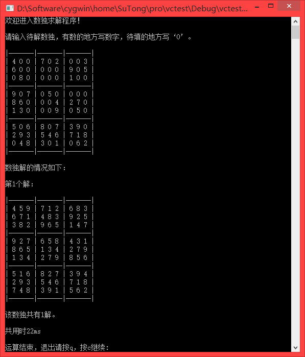
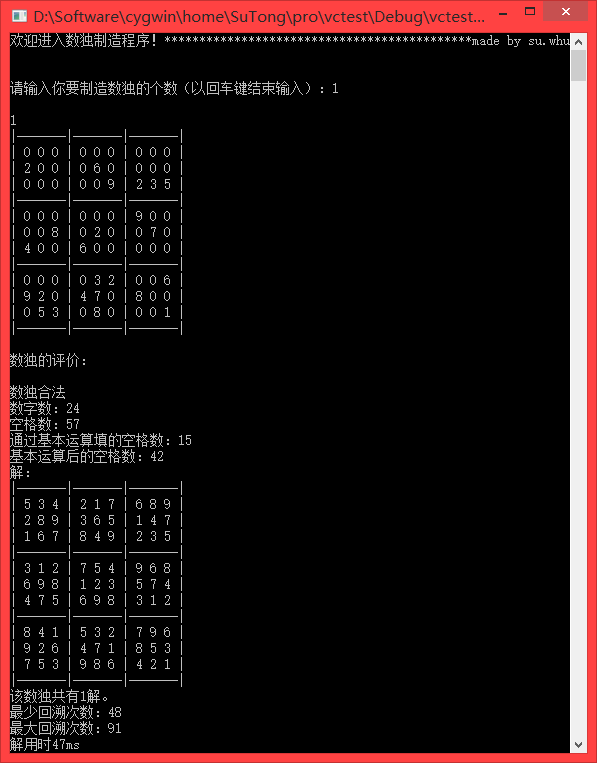
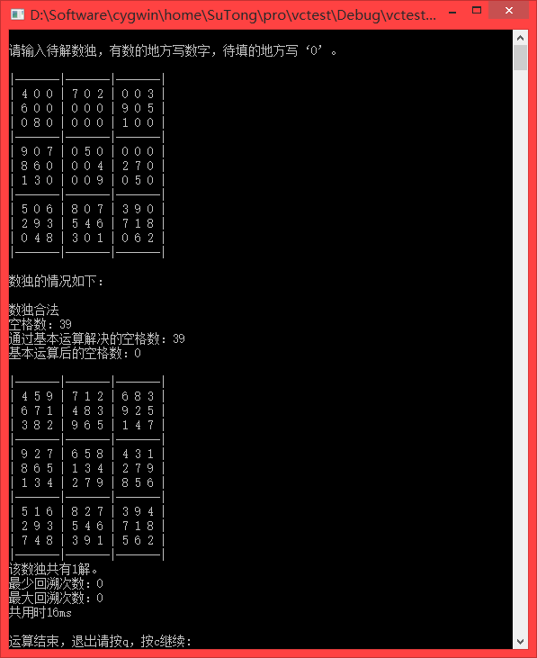

# Solve and Create Sudokus

*   `solve.cpp` Solve sudukus

*   `create.cpp` Create sudukus

*   `solve-evaluate.cpp` Solve & evaluate sudukus

## Developer Dependencies

*   MS Windows (`conio.h` is needed)

## Snapshot

*   
    ###Solve suduku

    

*   
    ### Create suduku

    
    
    
*   
    ### Create & evaluate suduku

    

    